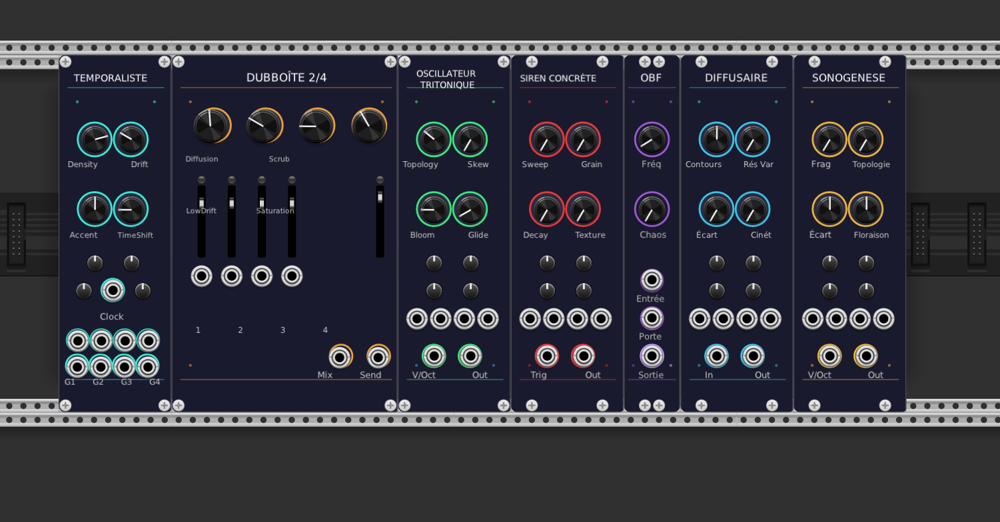

# VCV Rack Modules Collection



# VCV Rack Modules Collection


A focused set of experimental VCV Rack modules shaped by early French electronic research—musique concrète, acousmatic composition, spatial sound analysis—and the disciplined timing, feedback, and spectral shaping of classic dub engineering.

Each module treats sound as a physical process: grains, spectra, delay paths, instability, and perception.

## Modules

### OBF — Oscillateur à Basse Fréquence

A compact LFO built around controlled chaos.

- Sine output
- Gate in/out
- Chaos modulation for bounded randomness
- Purple theme

### SONOGENESE — Experimental VCO

A waveform generator based on fragmentation and spectral mutation.

- Grain-based micro-synthesis
- Chebyshev polynomial warping
- Nonlinear phase skew
- Harmonic bloom with spread
- Gold theme

### DIFFUSAIRE — Spectral Filter

A filter shaped by diffusion theory and phase dispersion.

- Morphable multi-pole contours
- Resonance from analog to metallic
- All-pass phase dispersion (Écart)
- Optional wow/flutter
- Cyan theme

### SIREN CONCRÈTE — Dub Siren + Concrète Sampler

A performance instrument combining dub siren control with granular sampling.

- 8-grain scatter
- Multi-harmonic spectral shift
- Tape-style drift
- 8-tap delay bloom
- Red theme

### DUBBOÎTE 2/4 — Dub Mixer

A four-channel dub mixer emphasizing 2/4 routing and spatial diffusion.

- Independent channel strips
- Multi-path diffusion
- Tape scrub modulation
- Bass drift sculpting
- Harmonic saturation feedback
- Orange theme

### OSCILLATEUR TRITONIQUE — Tritone Oscillator

A tone engine built on tritone tension and shifting harmonics.

- Morphing topology
- Micro-delay timing coloration
- Tritone-oriented harmonic bloom
- Tritone glide
- Green theme

### TEMPORALISTE — Generative Polyrhythm Engine

A probabilistic rhythm generator focused on microtiming and layered density.

- Density and probability per layer
- Timing drift
- Harmonic "accent shaping" for gates
- Micro-offset per layer
- Teal theme

---

## Design Philosophy

These modules reflect a hybrid lineage:

- GRM-style spectral and temporal analysis
- Musique concrète's attention to gesture, fragmentation, and source ambiguity
- Dub's discipline of echo, feedback, saturation, and low-frequency motion
- Spatial reasoning through delay networks and diffusion
- Controlled instability: wow, flutter, dispersion, microtiming

The goal is not retro emulation, but a scientific yet reflective approach to sound—treating time, frequency, and space as materials that can be shaped.

## Building

```bash
cd OBF && make devinstall
cd Sonogenese && make devinstall
cd Diffusaire && make devinstall
cd SirenConcrete && make devinstall
cd DubBoite && make devinstall
cd OscillateurTritonique && make devinstall
cd Temporaliste && make devinstall
```

## Requirements

- VCV Rack SDK 2.x
- C++11 compiler
- Make

## License

MIT License
